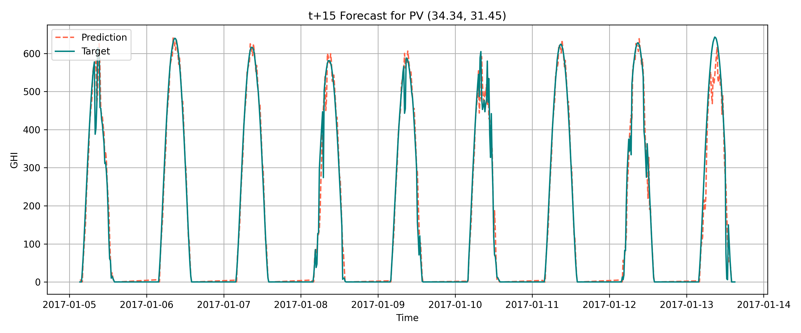

# ☀️⚡SolarMLProject
## Overview
This repository documents our final project for the B.Sc. in Electrical Engineering at Tel Aviv University.
The project was conducted by Hadar Levy and Gal Schwartz, under the supervision of Khen Cohen.

## Objective
The goal of the project is to develop a machine learning model based on Graph Neural Networks (GNNs) to predict Global Horizontal Irradiance (GHI) for four future time horizons: 15, 30, 45, and 60 minutes ahead.

## Project Structure

## Results / Evaluation
- NRMSE:
  - 15 minutes:
  - 30 minutes:
  - 45 minutes:
  - 60 minutes:
- NMAE:
  - 15 minutes:
  - 30 minutes:
  - 45 minutes:
  - 60 minutes:

## Limitations and Future Work
- Improve accuracy for longer-term forecasts
- Add real-time weather data integration
- Explore transformer-based GNN models

## Credits
This project was developed by Hadar Levy and Gal Schwartz under the supervision of Khen Cohen at Tel Aviv University.

