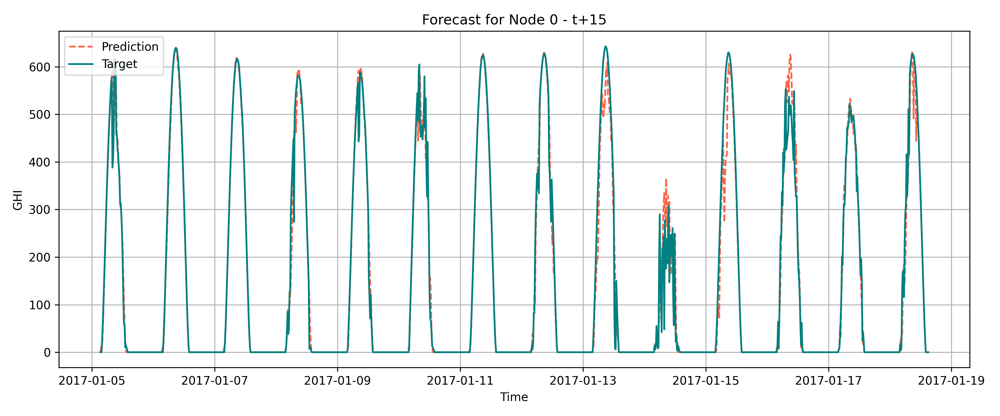

# ☀️⚡SolarMLProject
## Overview
This repository documents our final project for the **B.Sc. in Electrical Engineering at Tel Aviv University**.
The project was conducted by **Hadar Levy** and **Gal Schwartz**, under the supervision of **Khen Cohen**.

## Objective
The goal of the project is to develop a machine learning model based on **Graph Neural Networks (GNNs)** to predict **Global Horizontal Irradiance (GHI)** for four future time horizons: **15, 30, 45, and 60 minutes ahead**.

## Repository Layout
- `.idea/` – IDE config.
- [`Batching_Nodes/`](./Batching_Nodes) – Code for node batching and preparation for GNN (an alternative method we tested but ultimately did not use).
- [`Clouds_Simulator/`](./Clouds_Simulator) – Code for creating a synthetic dataset using cloud masks generated by the cloud simulator from this repo: https://github.com/khencohen/SolarPanels. This approach was eventually abandoned due to computational constraints.
- [`Correlations/`](./Correlations) – Scripts for correlation calculations.
- [`Data/`](./Data) – Processed datasets for training and testing.
- [`Metrics/`](./Metrics) – Evaluation scripts for error metrics and comparisons.
- [`Model/`](./Model) – GNN model definitions and training logic.
- [`Project/`](./Project) – Project book, poster, and final presentation (PPTX).
- [`Results/`](./Results) – Forecast output plots and visualizations. Visualized predictions for 15, 30, 45, and 60-minute horizons.
- [`data_processing/`](./data_proccessing) – Scripts to create and convert datasets into graph format.
- [`README.md`](./README.md) – This documentation file.

## Results / Evaluation
| Time Horizon | NRMSE (%) | NMAE (%) |
|--------------|-----------|----------|
| 15 minutes   |    8.25   |   11.35  |
| 30 minutes   |    9.13   |   13.16  |
| 45 minutes   |    10.02  |   15.14  |
| 60 minutes   |    10.76  |   16.46  |

### 📈 Forecast vs. Actual for GHI @ t+15 minutes

## Limitations and Future Work
- Improve accuracy for longer-term forecasts
- Add real-time weather data integration

## References & Acknowledgements
This project makes use of external tools and datasets, including:
- **SatelliteCloudGenerator**
  - Repository: [strath-ai/SatelliteCloudGenerator](https://github.com/strath-ai/SatelliteCloudGenerator)  
  - Publication: Czerkawski, M.; Atkinson, R.; Michie, C.; Tachtatzis, C. SatelliteCloudGenerator: Controllable Cloud and Shadow Synthesis for Multi-Spectral Optical Satellite Images. Remote Sensing 2023, 15(17), 4138. https://doi.org/10.3390/rs15174138
 - **SolarPanels Cloud Simulator**
  - Repository: [khencohen/SolarPanels](https://github.com/khencohen/SolarPanels)  
## Credits
This project was developed by Hadar Levy and Gal Schwartz under the supervision of Khen Cohen at Tel Aviv University.
